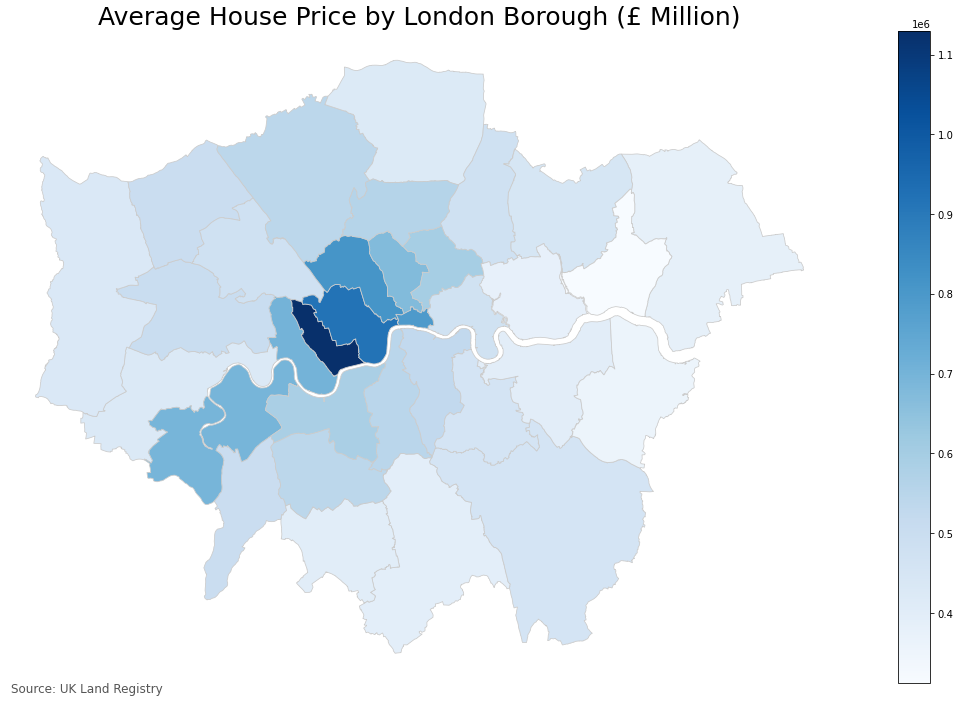

# London House Price Forecasting

The objective of this project is to forecast what the average house price will be in any given London post code up to 5 years from now. 
The target user of this model could be anybody interested in property prices, from a first time buyer who wants to make sure they invest their money wisely or an investor who may be buying and selling property on a more frequent basis.

## Why is this useful?

Buying a home for most people is the biggest investment that they will ever make, it makes sense to do your research. If analysis shows a home in one zip code is more likely to increase in price vs a home in an other this could impact your decision on where to buy, especially if there was little else between them.

## The Data

The data was sourced from the UK Government Land Registry [website](https://landregistry.data.gov.uk/app/ppd/). Initially a search on London was performed, and then a wider search to ensure all Boroughs were captured.

There were over 2.5 million rows of data extracted from the source above, each row containing pertinent details relating to individual house sales between January 2000 and May 2021.

Further data from [London Government Site](https://data.london.gov.uk/dataset/average-house-prices) was used for EDA purposes at the Borough level.

## London Boroughs

London is a vast city made up of 32 Boroughs and The City of London, sometimes referred to as the Square Mile and like any other capital or even Global City, it is expensive. The average home in London is 2 times the average of the rest of the UK.
As with any large city however, there is diversity in the housing stock meaning that whilst you don't need to be a multi-millionaire to get your foot on the housing ladder (it always helps).

## House Price by Borough

It is clear that there is a premium in Central Boroughs, with Kensington and Chelsea averaging over £1million. There are however, affordable Boroughs if you are willing to commute. 

## House Price History

Have all the house prices behaved in a similar fashion? Looking at the plot it appears so, although there certainly seems to be a ripple effect where changes both positive and negative are of a higher magnitude as you move towards the pricier central Boroughs. 

## Modeling

Initial ARIMA and SARIMA modeling performed on one postcode to establish sensible parameters and a sound methodology, however, this was not practical for the sheer number of postcodes that would need to be forecasted (200+).

Pmdarima's auto_arima function was therefore utilised to find the best parameters for each postcode dataset. An example of model performance vs test data for postcode HA5 can be seen below.

There has clearly been a black swan event in 2020 which of course was COVID-19. This has impacted house prices in Boroughs differently across London, as such there errors on some postcode models are higher than would be expected, this is difficult to overcome and would be improved with more and more recent data being added. This is of course a learning, and perhaps an indication of the type of exogoneous data that could be incorporated into a model. 

## Results

Each postcode has an upper and lower limit to the confidence interval in the forecast as can be seen below for HA5. Therefore there are three rate of returns that could be of interest depending on the view of risk in the eyes of the investor. 

For example an investor who does not care about the money whatsoever may just chase the maximum returns in the upper limit of the confidence interval, whereas a risk averse investor may want to avoid large negative numbers on the lower limit of the confidence interval. 

Summary tables can be tailored to suit, the summary table below is displaying the top 5 postcodes based on P50 (middle of confidence interval) return on investment.

So where are these top 5? can we see any pattern?

With the exception of one the other 4 in the top 5 appear to be outside the city centre.
This follows a pattern observed during lockdown where there has been a premium on outdoor space and extra rooms for offices whilst working from home. Perhaps this trend could be reversed in the near future as we all rush back to cities?

## Conclusions & Recommendations

- Central and Expensive Boroughs seem to be subject to biggest fluctuations in price
- 4 of the top 5 postcodes with the highest rate of returns are outside what would be considered Central London
- 4 of the bottom 5 postcodes for rate of return are in central areas and/or close to financial hubs (The City of London or Canary Wharf)

There have been multiple things that have occurred in 2020 and 2021 which make house price forecasting challenging, firstly COVID-19 pandemic and its impact on people's working routines and their desire for more space.
Secondly the government introduced a Stamp Duty (Tax) holiday which, whilst saving money on taxes, actually raised asking prices of homes as there was a mad panic to purchase before this stamp duty holiday ended. 

Forecasting the rolling average with 12 month window helped smooth out some of these trends, but for events that last longer than one year like COVID-19 has, it can be problematic for forecasting.

As time series modelling is so sensitive to recent data, it is imperative that these models be updated regularly (at least quarterly) with recent data to ensure modelling errors remain small. 

It may be useful to introduce some exogenous data into the models:
- Bank of England interest rates
- COVID-19 infection rates
- Lockdown events
- Number of people returning to office work

